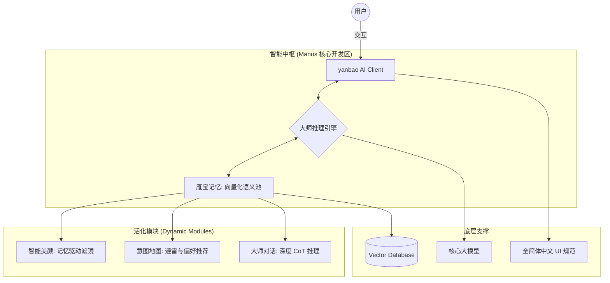

# Sanmu AI (yanbao AI) 智能化冲刺架构 (Phase 2: Inject Soul)

## 1. 核心架构 (Mermaid)

重点在于 **记忆中枢** 与 **大师推理引擎** 的深度接驳。



## 2. 7 天“注入灵魂”执行计划 (Sprint)

| 天数 | 阶段 | 关键任务 | 智能化动作 |
| :--- | :--- | :--- | :--- |
| **D1** | **基石** | 环境搭建与架构校对 | **剔除硬编码**：为美颜、地图、相册预留“记忆注入接口”。<br>**UI 规范**：除 `yanbao AI` 外，全简体中文。 |
| **D2** | **大脑** | 大师功能重塑 | **CoT 推理**：开发具备 Chain of Thought 能力的后端，模拟大师思考过程。 |
| **D3** | **神经** | 雁宝记忆系统接入 | **语义关联**：部署向量数据库，实现“跨时空对话”（记得用户一周前的偏好）。 |
| **D4** | **感知** | 媒体处理集成 | **语义修图**：用户说“像昨天的落日一样暖”，AI 自动提取参数合成。 |
| **D5** | **意图** | 地图推荐集成 | **意图预测**：结合记忆，主动推送符合用户品味的大师级旅行建议。 |
| **D6** | **包装** | UI/UX 优化 | **极致汉化**：增加“大师思考中”动效，优化会员权益智能弹窗。 |
| **D7** | **发布** | 测试与上线 | **性能审计**：确保记忆检索延迟 < 200ms。 |

## 3. 大师功能 Python 后端逻辑 (伪代码)

这段代码展示了如何让大师具备“思考过程”：

```python
# yanbao AI 大师功能核心逻辑
class yanbaoMasterBrain:
    def __init__(self, user_id):
        self.user_id = user_id
        self.memory = YanbaoMemoryProvider(user_id)

    def process_request(self, user_input):
        # 1. 语义搜索相关记忆
        context = self.memory.search_relevant_shards(user_input)
        
        # 2. 构造思考链 (CoT)
        prompt = f"""
        你现在是 yanbao AI 的大师。
        已知记忆: {context}
        用户当前需求: {user_input}
        请先思考用户的深层意图，再结合专业知识给出建议。
        """
        
        # 3. 动态推理
        thinking_process = llm.generate_thinking(prompt)
        final_answer = llm.generate_response(thinking_process)
        
        # 4. 存入新记忆
        self.memory.save_interaction(user_input, final_answer)
        
        return final_answer
```

## 4. 核心目标

*   **拒绝死功能**：不再是简单的关键词匹配，而是基于记忆的深度推理。
*   **全简体中文**：严格执行 UI 规范，打造沉浸式中文体验。
*   **记忆驱动**：让 AI 越用越懂用户，实现真正的个性化。
